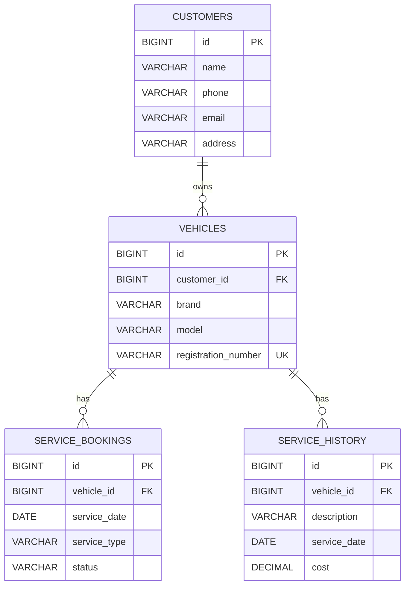

# ER Diagram and Normalization

## ER Diagram

## Functional Overview

- A customer can own multiple vehicles.
- A vehicle can have multiple future or past bookings.
- A vehicle can have multiple completed service history records.

## Normalization Discussion

### First Normal Form (1NF)

The schema satisfies 1NF because:

- Each table has a primary key.
- Each column stores atomic values.
- There are no repeating groups in a single row.

### Second Normal Form (2NF)

The schema satisfies 2NF because:

- All tables use single-column primary keys.
- Every non-key attribute depends on the whole primary key.

### Third Normal Form (3NF)

The schema satisfies 3NF because:

- Non-key attributes depend only on the primary key.
- Customer details are stored only in `customers`.
- Vehicle details are stored only in `vehicles`.
- Booking data and history data are separated to avoid redundancy.

## Why This Design is Good for DBMS

- Reduces duplicate customer and vehicle data
- Maintains referential integrity through foreign keys
- Supports efficient search using indexes
- Supports reporting using views and aggregate queries
- Supports transactional operations using stored procedures
